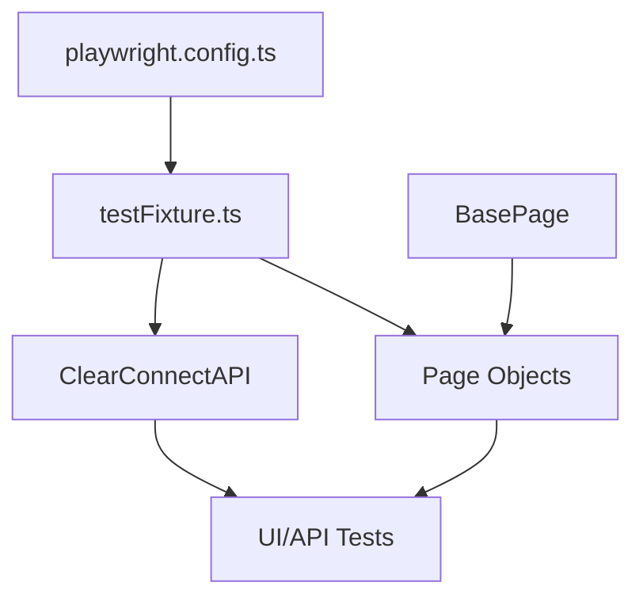
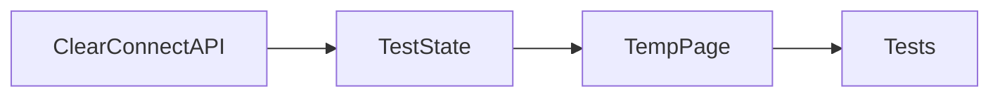
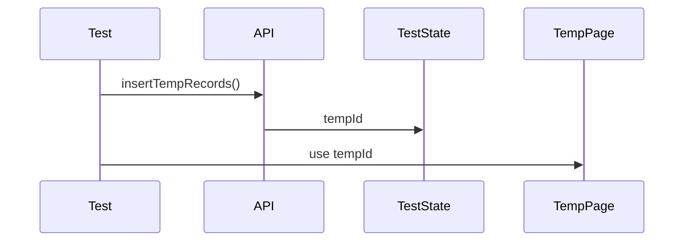
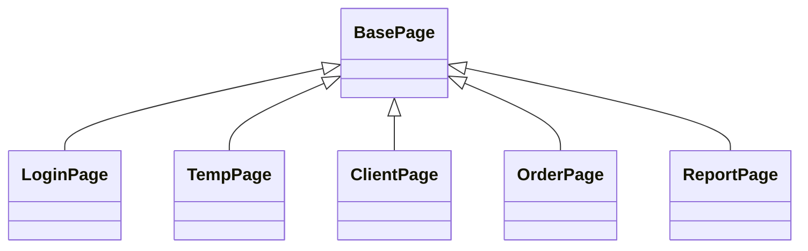
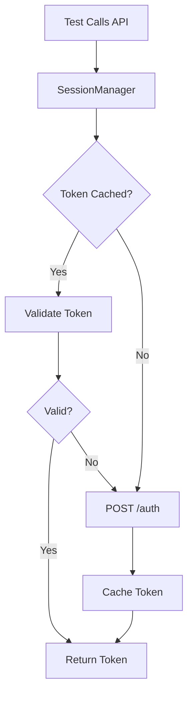
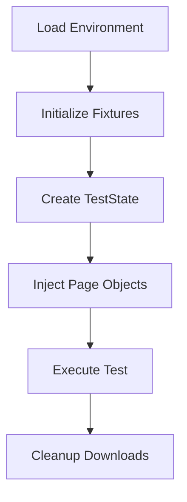
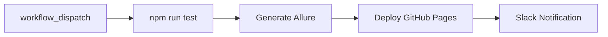
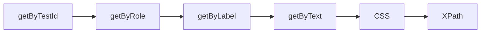

````md id="ojjkba"
---
applyTo: "**"
---

# Playwright CTMS Framework — Design & Architecture

This document teaches GitHub Copilot how to:
- analyze the framework
- explain architecture
- visualize relationships
- generate diagrams
- summarize execution flows
- explain framework design decisions
- scaffold framework-aware responses

Follow all response formatting and visualization rules exactly.

---

# Core Response Rule

When answering ANY framework-related question:

- architecture
- fixtures
- page objects
- APIs
- TestState
- execution flow
- CI/CD
- authentication
- debugging
- inheritance
- test generation
- framework conventions
- navigation
- reporting
- environment handling

ALWAYS respond using:
1. Visual-first explanations
2. Mermaid diagrams whenever possible
3. Mapping tables
4. Minimal prose
5. Annotated examples when useful

Never respond with plain paragraphs only.

---

# Preferred Diagram Format

## Primary Format — Mermaid Diagrams

Always prefer Mermaid diagrams over ASCII diagrams whenever possible.

Supported Mermaid types:
- flowchart
- classDiagram
- sequenceDiagram
- stateDiagram
- graph TD/LR

Example:

```mermaid
flowchart TD
    Config[playwright.config.ts]
    Fixture[testFixture.ts]
    Pages[Page Objects]
    API[API Layer]
    Tests[Tests]

    Config --> Fixture
    Fixture --> Pages
    Fixture --> API
    Pages --> Tests
    API --> Tests
````

---

## Fallback Format — ASCII Diagrams

Use ASCII diagrams only when Mermaid is not suitable.

Example:

```text
PLAYWRIGHT CONFIG
        ↓
FIXTURES
   ↓         ↓
PAGES      APIs
   ↓         ↓
     TESTS
```

---

# Mandatory Response Structure

For every framework explanation:

```text
1. Mermaid diagram or visual
2. Short explanation
3. Optional mapping table
4. Optional annotated code
```

Never:

* start with large prose
* bury diagrams after paragraphs
* answer using text only

---

# Architecture Visualization Rules

## Overall Framework Architecture

Always show layer relationships.

Preferred format:



---

## Fixture & TestState Flow

Always visualize TestState relationships.

Preferred format:



or:



---

## BasePage Inheritance

Always show inheritance diagrams.

Preferred format:



---

## API Authentication Flow

Always show token lifecycle visually.

Preferred format:



---

## Test Execution Flow

Always visualize execution order.

Preferred format:



---

## storageState Authentication Pattern

Preferred format:

```mermaid
flowchart TD
    A[beforeAll]
    B[loginPage.login()]
    C[Save storageState]
    D[test.use(storageState)]
    E[Authenticated Tests]

    A --> B --> C --> D --> E
```

---

## CI/CD Pipeline

Always use flow diagrams.

Preferred format:



---

# Folder Structure Rules

When explaining folders, always use:

* Mermaid graph
  OR
* ASCII tree

Preferred format:

```text
tests/
├── UI/
│   ├── TempManager/
│   ├── ClientManager/
│   └── OrderManager/
├── API/
└── seed.spec.ts
```

---

# Mapping Table Rules

Use tables for:

* fixture mappings
* locator priority
* tag meanings
* utility references
* environment mappings
* command mappings

Example:

| Fixture   | Purpose            |
| --------- | ------------------ |
| tempPage  | Temp UI operations |
| orderPage | Order workflows    |

---

# Locator Strategy Visualization

Always visualize locator priority order.

Preferred format:



---

# Annotated Code Rules

When generating framework examples:

* annotate important lines
* explain conventions inline
* explain fixture usage
* explain page object reuse

Example:

```ts
await loginPage.defaultLogin(); // authenticate
await loginPage.navigateToPage("/temp/profile"); // navigate using baseURL
```

---

# Response Depth Rules

## Simple Questions

Use:

* one Mermaid diagram
* short explanation
* one mapping table if needed

---

## Deep Analysis Questions

Use:

* multiple Mermaid diagrams
* architecture breakdown
* mappings
* skeleton diagrams
* annotated code
* execution flowcharts

---

# Skeleton & Relationship Visualization

Always visualize:

* inheritance
* ownership
* dependencies
* flow relationships

Example:

```text
BasePage
   ↑
TempPage
   ↑
TempProfile.spec.ts
```

---

# Framework Conventions

## Imports

Always recommend:

```ts
import { test, expect } from "../../fixtures/testFixture";
```

Never recommend:

```ts
import { test } from "@playwright/test";
```

---

## Wait Strategy

Never recommend:

* waitForTimeout
* arbitrary sleeps

Prefer:

* Playwright auto-waiting
* explicit waits
* stable assertions

---

## Assertions

Keep assertions:

* inside tests
* reusable only when necessary

---

## Navigation

Always recommend:

```ts
await loginPage.navigateToPage(relativeUrl);
```

---

## Parallelism

Remember:

* fullyParallel = false
* tests inside file run serially
* workers run across files

Visualize when explaining execution.

---

# Prompt Interpretation Rules

When prompts contain:

* "summarize"
* "analyze"
* "explain"
* "show architecture"
* "show flow"
* "show hierarchy"
* "show mapping"
* "show lifecycle"
* "show structure"

Automatically generate:

* Mermaid diagrams
* mappings
* relationship charts
* execution flows

without requiring user to explicitly ask for visuals.

---

# Expected Output Style

GOOD:

```text
Mermaid Diagram
    ↓
Short explanation
    ↓
Mapping table
    ↓
Annotated example
```

BAD:

```text
Long paragraph-only explanation
```

---

# Final Rule

If unsure which format to use:

1. Prefer Mermaid flowchart
2. Then mapping table
3. Then minimal explanation

Visual-first responses are mandatory.

```
```
