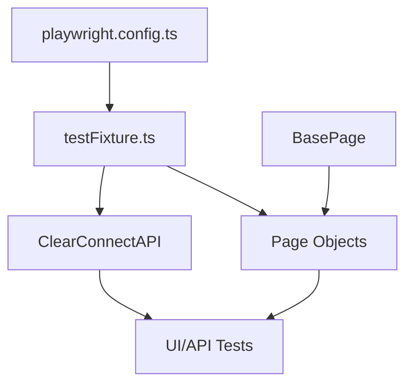
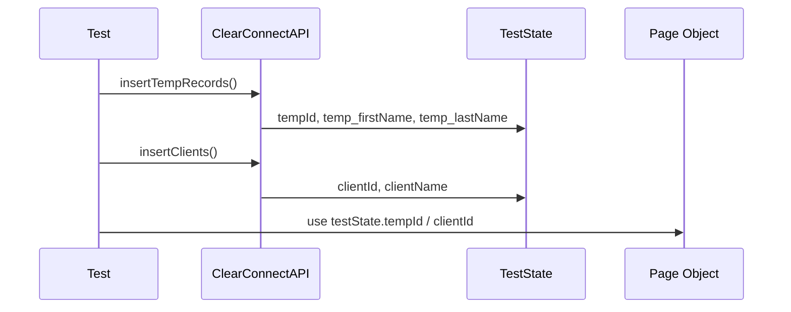
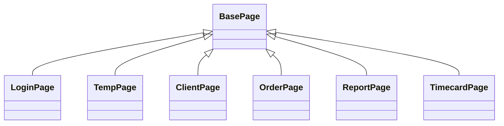
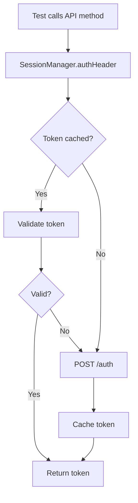
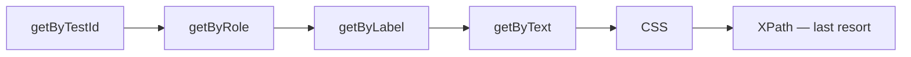
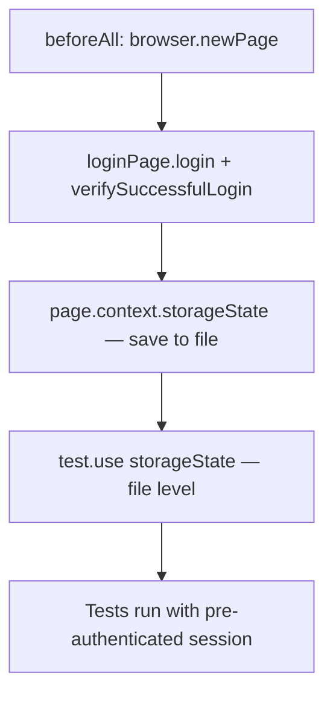
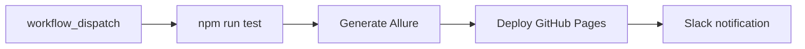

# Playwright CTMS Framework — Design & Architecture

Reference for understanding, explaining, and visualizing this framework's architecture. Apply these formatting rules when answering questions about how the framework works. **Do not apply them when generating production code** — production code follows the rules in `copilot-instructions.md` and the feature-specific instruction files.

---

## Preferred response format for framework explanations

1. Visual diagram (Mermaid preferred) or ASCII tree
2. Short explanation
3. Mapping table where useful
4. Annotated example only when illustrating a concept — never add inline comments to production code

### Mermaid diagram types

Use `flowchart`, `classDiagram`, `sequenceDiagram`, `stateDiagram`, or `graph TD/LR`.

---

## Architecture



---

## Directory structure

```
PlaywrightFramework/
├── fixtures/testFixture.ts          # Custom typed fixtures (page objects + testState)
├── pages/
│   ├── BasePage.ts                  # Base class — common wrappers & shared locators
│   ├── ClearConnectAPI.ts           # REST API layer
│   └── [FeaturePage].ts            # Feature page objects extending BasePage
├── utils/RandomUtil.ts              # Dynamic test data helpers
├── test-data/
│   ├── Types.ts                     # Ambient global types (no import needed)
│   ├── AllverificationData.ts       # Static assertion strings
│   ├── MultipleClientData.ts        # Data-driven arrays
│   └── users.json                   # Named test user credentials
└── tests/
    ├── UI/<Feature>/                # UI specs (one file per feature area)
    ├── API/ClearConnect.spec.ts     # API-only specs
    └── seed.spec.ts
```

---

## TestState flow



---

## BasePage inheritance



`BasePage` provides: `TypeText`, `Click`, `ElementVisible`, `SelectOption`, `TypeTextEnter`, plus protected locators `saveButton`, `addressTextbox`, `cityTextbox`, `stateTextbox`, `zipTextbox`, `statusDropdown`.

---

## API authentication flow



---

## Locator priority



---

## Test execution flow

```mermaid
flowchart TD
    A[Load .env.{NODE_ENV}]
    B[Initialize fixtures]
    C[Create TestState per test]
    D[Inject page objects]
    E[Execute test body]
    F[Cleanup downloads if needed]

    A --> B --> C --> D --> E --> F
```

---

## storageState pattern



---

## CI/CD pipeline



---

## Key conventions (quick reference)

| Convention | Rule |
|------------|------|
| Import | Always from `fixtures/testFixture.ts`, never `@playwright/test` |
| Dynamic data | `RandomUtil.generateRandomString/Number/AlphaNumeric/getDate` |
| Waiting | Playwright auto-wait + explicit assertions — never `waitForTimeout` |
| Navigation | `loginPage.navigateToPage(partialUrl)` — partial URL resolved against `baseURL` |
| Tags | `@smoke` (critical path), `@regression` (full coverage), `@api` (API-only) |
| Parallelism | `fullyParallel: false` — tests within a file run serially; workers run across files |
| Comments | None in production code — only when the WHY is non-obvious |
